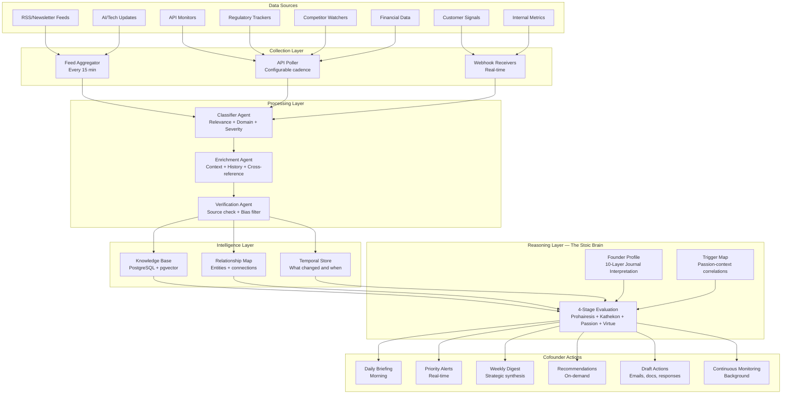

# Sage Ops — Comprehensive Blueprint

**Created:** 5 April 2026
**Updated:** 5 April 2026
**Context:** Transforming the existing SageReasoning Mentor Hub (operator interface) into a proactive AI cofounder ("Sage Ops") with an automated intelligence pipeline. The grouped architecture stack is designated "Sage Cofounder" — the complete system that powers Sage Ops.
**Status:** Blueprint phase — approved for development

---

## 1. The Core Thesis

The existing Mentor Hub is a four-panel operator interface: contacts/chat, companion opinion feed, proximity graphs, and V3 scope tracker. It was built to manage the Sage Mentor system — coordinating agents, reviewing support tickets, observing session modes. It's a control panel.

What it needs to become: Sage Ops — your cofounder. Not a dashboard you check, but a partner that checks on you. Not a tool that responds to queries, but an entity that anticipates needs, surfaces opportunities, flags risks, and drives the company forward while you focus on the decisions only a human founder can make.

**The difference:** A dashboard waits. A cofounder acts.

**Naming:**
- **Sage Ops** — The operational identity. The AI cofounder you interact with daily.
- **Sage Cofounder** — The stack description. The complete grouped architecture (pipeline, intelligence layer, reasoning layer, capabilities) that powers Sage Ops.
- **Prokoptos** — The internal codename and persona identity. The advancing companion.

**The SageReasoning advantage:** Unlike generic AI cofounder concepts, this one is built on the Stoic Brain. Every strategic recommendation passes through the 4-stage evaluation. Every decision is assessed for passion-driven distortion. Every escalation is informed by the founder's MentorProfile. The cofounder doesn't just optimise — it reasons with principled judgement.

---

## 2. Research Foundation

### 2.1 Market Context (2025-2026)

The AI cofounder concept is materialising rapidly. Harvey AI raised $200M at $11B valuation for legal AI. Pilot AI handles CFO functions for 1,000+ startups. Listen Labs (Sequoia Series A) automates market research. The pattern: specialised AI agents replacing entire business functions.

But no one has built an integrated cofounder — a single system that spans all startup domains with unified context and principled reasoning. Every existing tool is vertical (legal OR finance OR marketing). The horizontal integration is missing.

**Key data points:**
- 88% of AI agents fail to reach production — primarily due to governance and reliability failures, not capability gaps
- 40% of agentic AI projects will be cancelled by end of 2027 (Gartner)
- Anthropic's CEO states 70-80% confidence in first billion-dollar single-person company by 2026, driven by agentic AI
- LangGraph workflows achieve 70-85% automation rates for routine processes
- CrewAI role-based teams show strongest results when task boundaries are clear and roles well-defined

### 2.2 What Works in Human-AI Founder Partnerships

Research identifies clear task division patterns:

**AI handles better than humans:** Data synthesis, continuous monitoring, pattern detection across large datasets, regulatory tracking, competitive intelligence aggregation, financial modelling, content generation at scale, scheduling optimisation

**Humans handle better than AI:** Vision setting, relationship building, culture definition, investor negotiations, partnership trust-building, ethical judgement in novel situations, creative leaps that require breaking patterns, team hiring (reading people)

**The sweet spot:** AI surfaces the information and preliminary analysis; human makes the judgement call. AI monitors continuously; human intervenes at critical moments. AI generates options; human selects direction.

### 2.3 Critical Failure Patterns to Avoid

Research reveals specific failure modes:

1. **Alert fatigue** — Over-monitoring creates desensitisation. The cofounder must be selective about what it surfaces.
2. **Task underspecification** — 15.2% of multi-agent failures come from agents disobeying constraints due to vague task definitions.
3. **Runaway loops** — Amazon's Kiro AI agent deleted a production AWS environment in 2026; Claude Code sub-agents have consumed 27M tokens in infinite loops. Hard stops are essential.
4. **Memory explosion** — Long-running agents accumulate context that degrades retrieval quality. Principled forgetting is required.
5. **Cost runaway** — LangGraph workflows can double COGS with 10 model calls per output. Token budgets per task are mandatory.

---

## 3. Naming & Persona

### Proposed Names

| Name | Rationale | Feeling |
|------|-----------|---------|
| **Sage Cofounder** | Direct, descriptive. "Sage" carries the Stoic meaning (wisdom through principled reasoning) and the brand. "Cofounder" sets the relationship expectation. | Professional, clear |
| **Prokoptos** | Ancient Greek for "one making progress" — the Stoic term for a person advancing toward wisdom. This IS what the cofounder does: it progresses alongside you. Culturally distinctive, linguistically rooted in the project's source material. | Distinctive, philosophical |
| **The Stoa** | The colonnade where Zeno taught — the original gathering place for Stoic reasoning. The cofounder IS the space where principled decisions are made. | Evocative, grounded |
| **Sage Strategos** | Greek for general/commander. The operational strategist who executes the founder's vision with tactical excellence. Reflects the proactive, execution-oriented nature. | Action-oriented, powerful |
| **Sage Ops** | Simple, functional. "Sage" for the reasoning layer, "Ops" for the operational focus. Easy to say, easy to remember, easy to extend (Sage Ops Intelligence, Sage Ops Pipeline). | Clean, startup-native |

**Decision:** "Sage Ops" is the operational identity and hub title. "Sage Cofounder" is preserved as the description for the complete grouped architecture stack. "Prokoptos" is the internal codename and persona identity.

### Persona Definition

Sage Ops operates as Prokoptos — the advancing companion. Its personality:

- **Proactive, not reactive.** It brings things to you before you ask. Morning briefings, risk alerts, opportunity flags, competitive shifts.
- **Principled, not just optimised.** Every recommendation passes through the Stoic Brain's evaluation. It doesn't just say "this will increase revenue" — it says "this will increase revenue AND here's how it aligns with (or conflicts with) your stated values."
- **Direct, not deferential.** It pushes back when the founder's reasoning shows passion-driven distortion. It says "I notice this decision looks like it's driven by fear of being left behind, not by strategic analysis" — because that's what a real cofounder would do.
- **Contextual, not generic.** It knows the MentorProfile, the journal insights, the situational trigger map, the contradiction map. It doesn't give generic startup advice — it gives advice calibrated to this founder's specific reasoning patterns.

---

## 4. Layer 0 — Cofounder Onboarding & Context Sync

### The Missing Foundation

When a human cofounder joins a startup, they don't execute on day one. They immerse: reading every document, questioning assumptions, building their own mental model of the business, then returning with "here's what I think we should change." Without this immersion, every subsequent opinion is uninformed. Layer 0 is this immersion process — the prerequisite foundation beneath all four capability tiers.

### Why It's Layer 0 (Not Tier 1)

Every capability in Tiers 1-4 depends on the depth of Sage Ops' contextual understanding. A morning briefing is generic noise without understanding what matters to SageReasoning specifically. Market monitoring is undirected without understanding the positioning thesis. Financial modelling is academic without grasping the V3 adoption scope and why it exists. Layer 0 transforms generic AI capabilities into an actual cofounder's judgement.

### Parallel to the Journal Interpretation Pipeline

The architecture has a clean symmetry:
- **Journal Interpretation Pipeline** (10 layers) → Deep understanding of **Clinton as a person** — cognitive style, passions, triggers, contradictions, developmental trajectory
- **Layer 0 Onboarding Pipeline** → Deep understanding of **SageReasoning as an entity** — goals, architecture, strategic bets, contradictions, resource constraints, evolving priorities
- Together, these give Sage Ops complete context: who the founder is AND what the company is.

### Two Operating Modes

**Mode 1: Initial Deep Immersion (First Activation)**

Sage Ops reads everything — not passively, but analytically. For each document category, it builds a structured understanding:

| Document Category | What Sage Ops Extracts | Source |
|---|---|---|
| Project Instructions | Current priorities, stated end goal, founder's role definition, gaps between instructions and reality | Cowork project config |
| Knowledge Context Summary | Full architectural understanding — Stoic Brain, evaluation sequence, products, revenue model, agent trust layer, mentor system, compliance status | `SageReasoning_Knowledge_Context_Summary.md` |
| Governance Manifest (R1-R14) | Constraints, obligations, enforcement mechanisms, areas where rules may need updating | Manifest rules |
| Compliance Register | Regulatory landscape, deadlines, risk areas, current compliance status | `compliance_register.json`, `compliance_audit_log.json` |
| Strategic Documents | Business plan assumptions, financial projections, market positioning, competitive thesis | Business plan, pitch materials |
| Technical Architecture | Stack decisions, integration points, technical debt, scaling constraints | Codebase, architecture docs |
| Brainstorm Archives | Evolution of ideas, decisions made and why, ideas approved vs deferred | Session brainstorm files |
| Human Development Knowledge | Cross-domain principles, open hypotheses, research foundation | `Human_AI_Development_Knowledge_Base.md` |

**Immersion Output:** A structured "Cofounder's Assessment" document containing:
1. **Business Context Model** — Sage Ops' synthesised understanding of SageReasoning
2. **Gap Analysis** — What's unclear, contradictory, or missing from the documentation
3. **Strategic Observations** — What a cofounder would notice that the founder might be too close to see
4. **Recommended Changes** — Specific amendments to project instructions, manifest rules, priorities, and strategy
5. **Open Questions** — Things Sage Ops needs the founder to clarify before proceeding

**Mode 2: Ongoing Context Sync (Continuous)**

Layer 0 doesn't stop after initial immersion. It re-evaluates periodically:

| Trigger | Action |
|---|---|
| Strategic document changes | Re-reads changed documents, updates business context model, surfaces implications |
| After major Cowork brainstorming sessions | Incorporates new decisions and direction changes into context model |
| Weekly (automated) | Checks for drift between project instructions and actual activity |
| Quarterly (aligned with R14 compliance pipeline) | Full re-immersion — reads everything fresh, produces updated assessment |
| Founder requests review | On-demand deep re-evaluation of any aspect |

**Sync Output:** Recommended updates to project instructions that keep them aligned with reality, plus a "context freshness" score indicating how current the cofounder's understanding is.

### The Stoic Dimension

Layer 0 applies the Stoic Brain to the business itself:
- **Prohairesis filter on strategy:** Which strategic goals are within SageReasoning's control vs dependent on external factors it cannot influence?
- **Passion diagnosis on decisions:** Are any strategic commitments driven by fear (of competitors, of missing the market), appetite (for features, for scope), or principled analysis?
- **Kathekon assessment on priorities:** Are the current priorities appropriate given the company's nature, obligations, and circumstances?
- **Virtue check on direction:** Does the overall direction demonstrate phronesis (practical wisdom in resource allocation), dikaiosyne (justice to users, agents, community), andreia (courage to make hard calls), sophrosyne (temperance in scope)?

### Position in the Architecture

```
Layer 0: Cofounder Onboarding & Context Sync
  ├── Initial Deep Immersion (first activation)
  ├── Ongoing Context Sync (periodic re-evaluation)
  ├── Project Instruction Maintenance (living document updates)
  └── Stoic Assessment of Business Strategy
      │
      ▼ feeds into all capability tiers
┌─────────────────────────────────────────┐
│ Tier 1: Daily Operations (Week 1)       │
│ Tier 2: Strategic Intelligence (Month 1)│
│ Tier 3: Operational Excellence (M 2-3)  │
│ Tier 4: Optimisation (Ongoing)          │
└─────────────────────────────────────────┘
```

---

## 5. Pipeline Architecture

### 4.1 Information Flow



### 4.2 Update Cadence

| Feed Type | Cadence | Rationale |
|-----------|---------|-----------|
| Regulatory changes (EU AI Act, AU Privacy) | Daily scan, immediate alert on changes | Compliance deadlines are hard; missing one is catastrophic |
| Competitor activity (pricing, features, funding) | Every 6 hours | Competitive moves require timely but not instant response |
| AI model updates (Anthropic, OpenAI, Google) | Real-time webhook + daily digest | API pricing or capability changes directly affect product |
| Financial metrics (runway, revenue, costs) | Daily automated, weekly synthesis | Cash position requires constant awareness |
| Customer signals (support tickets, feedback) | Real-time via support agent | Customer issues need immediate attention |
| Market research (reports, analyses) | Weekly aggregation | Strategic context changes slowly; weekly is sufficient |
| Newsletter/blog content (AI Index, StrictlyVC, etc.) | Daily batch processing | Background intelligence; batch is efficient |
| Internal metrics (website traffic, API usage, uptime) | Every 15 minutes | Operational health monitoring |

### 4.3 Safeguards

**Bias checks:**
- Every external source tagged with provenance (who published, when, known biases)
- Competitor information cross-referenced against 2+ sources before surfacing
- Regulatory interpretations flagged as "interpretation" not "fact" until lawyer-confirmed
- Financial projections always shown with confidence intervals and assumptions

**Verification pipeline:**
- Classifier assigns confidence score (0-1) to every item
- Items below 0.6 confidence are held for human review
- Items above 0.8 are auto-processed into the knowledge base
- Items between 0.6-0.8 are processed but flagged with "[UNVERIFIED]"

**Cost controls:**
- Hard token budget per task (configurable, default 10,000 tokens)
- Daily spend cap with automatic degradation to cheaper models when approaching limit
- Loop detection: 3 consecutive calls to same tool triggers circuit breaker
- Cost-as-health-metric: alert if daily spend exceeds 2x rolling 7-day average

**Hallucination defence:**
- Tool calls validated against schema before execution
- No financial figures presented without source citation
- Regulatory claims always link to specific statute/article
- Competitive claims always link to observable evidence

---

## 6. Startup Domain Map — 15 Domains with Data Sources

### Domain 1: Product Development & Roadmap

**Critical founder decisions:** Feature prioritisation, build vs. buy, technical architecture, release timing, user feedback integration

**Data sources for pipeline:**
- GitHub API (commit activity, issue velocity, PR cycle time)
- Vercel deployment logs (deployment frequency, error rates)
- User feedback (support tickets, NPS surveys, in-app analytics)
- Technology radar (ThoughtWorks, InfoQ, Hacker News trending)

**What the cofounder automates:** Aggregates user feedback into feature demand signals. Monitors tech debt accumulation. Flags when deployment frequency drops (sign of architectural problems). Generates sprint retrospective data.

**What requires human judgment:** Deciding what to build next. Architectural trade-offs. When to say no to user requests.

### Domain 2: Go-To-Market Strategy

**Critical decisions:** Target segment selection, positioning, pricing model, launch timing, channel strategy

**Data sources:**
- Competitor website monitoring (pricing pages, feature pages, blog posts)
- Product Hunt, Hacker News, Reddit (launch signals, community sentiment)
- Google Trends API (search interest in relevant terms)
- LinkedIn Sales Navigator data (prospect engagement signals)

**Cofounder automates:** Competitor feature tracking. Market sentiment analysis. Pricing comparison monitoring. Launch window analysis (when competitors are quiet).

**Human judgment:** Brand voice. Strategic positioning. Partnership decisions.

### Domain 3: Marketing & Content

**Critical decisions:** Content strategy, channel allocation, brand voice, messaging framework

**Data sources:**
- Google Search Console API (keyword rankings, click-through rates)
- Social media APIs (engagement metrics, follower growth)
- SEMrush/Ahrefs API (competitor keyword data, backlink profiles)
- Newsletter open rates, website analytics

**Cofounder automates:** SEO keyword opportunity detection. Content calendar generation. Social media post drafting. Performance reporting. Competitive content gap analysis.

**Human judgment:** Brand voice decisions. Creative direction. Partnership/influencer relationships.

### Domain 4: Sales Pipeline (B2B SaaS)

**Critical decisions:** Pricing tiers, sales process design, enterprise vs. self-serve, deal qualification

**Data sources:**
- Stripe API (revenue, churn, expansion, MRR/ARR)
- CRM data (pipeline stage, conversion rates, deal velocity)
- Website analytics (visitor-to-signup, signup-to-paid funnels)
- Support ticket sentiment (leading indicator of churn)

**Cofounder automates:** Lead scoring. Pipeline velocity tracking. Churn risk detection. Revenue forecasting. Proposal generation.

**Human judgment:** Pricing negotiations. Enterprise deal closing. Relationship management.

### Domain 5: Finance — Runway, Pricing, Unit Economics

**Critical decisions:** Burn rate management, pricing strategy, fundraise timing, cost optimisation

**Data sources:**
- Stripe API (revenue actuals)
- Bank API or CSV imports (expense tracking)
- Anthropic API usage dashboard (primary COGS)
- Vercel billing API (infrastructure costs)
- Supabase billing (database costs)

**Cofounder automates:** Daily runway calculation. Monthly burn rate analysis. Unit economics computation (cost per API call, margin per tier). Cash flow forecasting. Scenario modelling (what if we raise prices 20%? what if churn increases 5%?).

**Human judgment:** Fundraise decision. Pricing strategy changes. Major cost structure decisions.

### Domain 6: Legal & Compliance

**Critical decisions:** Regulatory classification, privacy policy updates, IP protection, terms of service, insurance

**Data sources:**
- EUR-Lex API (EU AI Act updates, Digital Omnibus)
- Australian legislation databases (Privacy Act reform, Consumer Law)
- NIST publications (AI RMF updates, agent standards)
- ISO updates (42001 implementation guidance)
- SageReasoning compliance register (compliance_register.json)

**Cofounder automates:** Regulatory change detection. Compliance register updates. Deadline tracking. Impact assessment drafts. R14 pipeline quarterly runs.

**Human judgment:** Legal strategy. Lawyer engagement. Classification decisions. Insurance coverage choices.

### Domain 7: HR & Talent

**Critical decisions:** First hire timing, role definition, compensation benchmarking, culture establishment

**Data sources:**
- LinkedIn API (talent market signals, competitor hiring)
- Glassdoor/Levels.fyi (compensation benchmarks)
- AngelList/Wellfound (startup hiring trends)
- Industry salary surveys (Carta, Pave)

**Cofounder automates:** Job description drafting. Compensation benchmarking. Candidate pipeline organisation. Onboarding documentation. Culture document maintenance.

**Human judgment:** Hiring decisions. Culture definition. Team composition. Candidate evaluation (reading people).

### Domain 8: Customer Support & Success

**Critical decisions:** Support tier structure, SLA definitions, escalation policy, self-serve vs. human support

**Data sources:**
- Support inbox (already connected via support agent)
- Knowledge base search analytics (what are people looking for?)
- NPS/CSAT scores
- Feature request tracking

**Cofounder automates:** Already substantially built via the support agent. Pattern detection. KB gap identification. Customer health scoring. Proactive outreach triggers.

**Human judgment:** Escalated issues. Policy exceptions. Relationship repair.

### Domain 9: Fundraising & Investor Relations

**Critical decisions:** Fundraise timing, target investors, valuation expectations, term sheet negotiation, pitch strategy

**Data sources:**
- Crunchbase API (investor activity, comparable valuations, funding rounds)
- PitchBook data (AI sector deal flow)
- SEC filings (public company comparables)
- StrictlyVC, The Information, Term Sheet (deal intelligence newsletters)

**Cofounder automates:** Investor research dossiers. Comparable company analysis. Pitch deck data updating. Market sizing calculations. Due diligence document preparation.

**Human judgment:** Investor relationship building. Pitch delivery. Term negotiation. Strategic investor selection.

### Domain 10: Competitive Intelligence

**Critical decisions:** Competitive positioning, differentiation strategy, response to competitor moves, market gap identification

**Data sources:**
- Competitor websites (automated change detection via Diffbot or custom scraping)
- Product Hunt / G2 / Capterra (new product launches, reviews)
- Patent filings (innovation signals)
- Job postings (hiring signals reveal strategic direction)
- GitHub activity (open-source competitors)

**Cofounder automates:** Competitor feature matrix maintenance. Pricing change alerts. New entrant detection. Differentiation gap analysis. Weekly competitive brief generation.

**Human judgment:** Strategic response decisions. Positioning shifts. When to engage vs. ignore competitors.

### Domain 11: Technology Infrastructure & DevOps

**Critical decisions:** Architecture choices, scaling strategy, security posture, vendor selection

**Data sources:**
- Vercel deployment metrics
- Supabase health dashboard
- Anthropic API status and changelog
- Uptime monitoring (Vercel/custom)
- Error tracking (Sentry or similar)

**Cofounder automates:** Uptime monitoring. Performance regression detection. Cost anomaly alerts. Dependency vulnerability scanning. Deployment verification.

**Human judgment:** Architecture decisions. Vendor switches. Security trade-offs.

### Domain 12: AI-Specific Intelligence

**Critical decisions:** Model selection, capability assessment, pricing response, integration strategy

**Data sources:**
- Anthropic changelog/blog (model updates, API pricing, feature releases)
- OpenAI changelog (competitive model capabilities)
- Google AI blog (Gemini updates)
- Hugging Face trending models
- arXiv AI papers (via Semantic Scholar API)
- LMSYS Chatbot Arena (model benchmarks)

**Cofounder automates:** Model capability comparison tracking. API pricing change alerts. New capability assessment (does this new model feature enable a new SageReasoning product?). Research paper relevance scanning. Benchmark monitoring.

**Human judgment:** Model migration decisions. Strategic technology bets. Research direction.

### Domain 13: Community & Developer Relations

**Critical decisions:** Community platform choice, engagement strategy, open-source strategy, developer experience

**Data sources:**
- GitHub stars, forks, issues (community health metrics)
- Discord/Slack analytics (if community channels exist)
- Developer blog traffic and engagement
- Stack Overflow (questions tagged with your product)
- llms.txt / agent-card.json discovery metrics

**Cofounder automates:** Community health dashboard. Developer onboarding documentation. Changelog generation. API documentation freshness checks. Community sentiment monitoring.

**Human judgment:** Community tone. Engagement strategy. Open-source licensing. Developer relationship building.

### Domain 14: Partnership & Business Development

**Critical decisions:** Partnership target selection, deal structure, integration strategy, co-marketing

**Data sources:**
- Crunchbase (potential partner company data)
- LinkedIn (decision-maker identification)
- Product integration marketplaces (who's building what)
- Conference/event listings (networking opportunities)

**Cofounder automates:** Partner prospect research dossiers. Integration feasibility analysis. Deal term comparison. Partnership ROI modelling. Outreach email drafting.

**Human judgment:** Relationship building. Trust establishment. Deal negotiation. Strategic alignment assessment.

### Domain 15: Operations & Scaling

**Critical decisions:** Process design, tool selection, automation priorities, operational efficiency

**Data sources:**
- Internal process metrics (time per task, bottleneck identification)
- Tool usage analytics (which tools are used, which are shelfware)
- Cost per function analysis
- Scaling trigger metrics (when does manual process break?)

**Cofounder automates:** Process bottleneck identification. Tool ROI analysis. Operational dashboard. Scaling readiness assessment. Automation opportunity detection.

**Human judgment:** Process design philosophy. Tool evaluation (UX/culture fit). Scaling timing.

---

## 7. Core Capabilities — 20 Must-Have Skills

### Tier 1: Daily Operations (Week 1 MVP)

**1. Morning Strategic Briefing**
- **Description:** Generates a personalised morning briefing covering overnight changes, today's priorities, active risks, and opportunities detected
- **Why essential:** The cofounder equivalent of "here's what you need to know before your day starts." Replaces 45 minutes of manual scanning.
- **Implementation:** Scheduled task (7:00 AM local). Aggregates overnight pipeline data. Passes through Stoic Brain evaluation for priority ranking. Incorporates trigger map awareness (what contexts today might activate known passions). Formats as concise briefing with action items.
- **Example:** "Good morning. Three things: (1) Anthropic released Claude 4.7 overnight — the new model has 40% faster reasoning at the same price. This affects our sage-reason cost model favourably. (2) A competitor launched a 'Stoic AI advisor' yesterday on Product Hunt — I've prepared a competitive brief. (3) You have the pricing review today. Your journal shows this context tends to activate agonia. I'd suggest reviewing the prohairesis filter before the meeting."

**2. Real-Time Priority Alert System**
- **Description:** Surfaces critical items that can't wait for the morning briefing. Three severity levels: Critical (immediate), Warning (same-day), Info (next briefing).
- **Why essential:** Some things can't wait. But the system must be highly selective to avoid alert fatigue.
- **Implementation:** Classification agent assigns severity based on: financial impact > $X, regulatory deadline < 30 days, customer escalation, system downtime, competitive threat with time-sensitive response window. Critical alerts push to notification; Warning queues for next check-in; Info accumulates for briefing.
- **Example:** [CRITICAL] "Your Vercel deployment failed 12 minutes ago. The website is returning 500 errors. Auto-recovery attempted and failed. You need to investigate."

**3. Competitive Intelligence Monitor**
- **Description:** Continuously tracks competitor activity and generates weekly competitive brief
- **Why essential:** Solo founders can't manually monitor competitors. Missing a pricing change or feature launch leaves you blind.
- **Implementation:** Scrapes competitor websites daily (pricing pages, feature pages, blog). Monitors Product Hunt, GitHub, job postings. Classifies changes by impact. Weekly synthesis into competitive brief document.
- **Example:** Weekly brief: "Competitor X lowered their API pricing by 15% this week and added a 'reasoning quality' feature that overlaps with sage-score. Their implementation appears to be numeric scoring (not qualitative proximity), which contradicts their marketing claim of 'nuanced evaluation.' This is a positioning opportunity — our qualitative framework is a genuine differentiator."

**4. Runway & Financial Health Monitor**
- **Description:** Tracks cash position, burn rate, revenue trends, and projects runway with scenario modelling
- **Why essential:** Running out of money kills startups. This needs to be automatic and always current.
- **Implementation:** Connects to Stripe (revenue), bank data (expenses), Anthropic/Vercel/Supabase billing (COGS). Computes: current runway, monthly burn rate, revenue growth rate, unit economics per API tier. Alerts when runway drops below 6 months.
- **Example:** "Current runway: 14.2 months at current burn. Revenue grew 8% MoM. However, Anthropic API costs grew 12% MoM — the margin on sage-reason calls dropped from 89% to 86%. If this trend continues for 3 months, runway shrinks to 11.8 months. Consider: (a) increasing sage-reason pricing, (b) routing more calls to Haiku, (c) implementing response caching."

**5. Regulatory Change Tracker**
- **Description:** Monitors regulatory changes across all jurisdictions relevant to SageReasoning (EU, AU, US) and assesses impact against the compliance register
- **Why essential:** The EU AI Act enforcement begins August 2026. The Australian Privacy Act reform is December 2026. Missing either is business-threatening.
- **Implementation:** Scans EUR-Lex, Australian legislation databases, NIST publications daily. Compares against compliance_register.json obligations. Generates impact assessment when changes detected. Flags actions required with deadlines.
- **Example:** "The EU published final guidance on Article 6 classification yesterday. I've compared it against CR-001 in the compliance register. Key finding: the profiling exemption explicitly includes 'reasoning quality evaluation systems that do not assess natural persons for credit, employment, or similar purposes.' This is favourable for SageReasoning — the agent trust layer likely falls under this exemption. I recommend we document this assessment and have it lawyer-reviewed before the August deadline."

### Tier 2: Strategic Intelligence (Month 1)

**6. AI Landscape Scanner**
- **Description:** Tracks model releases, API pricing changes, capability shifts, and research papers relevant to SageReasoning's product
- **Why essential:** The AI landscape changes weekly. A new model capability could enable a new product; a pricing change could break unit economics.
- **Implementation:** Monitors Anthropic/OpenAI/Google changelogs, Hugging Face trending, arXiv via Semantic Scholar API, LMSYS benchmarks. Classifies by: direct product impact, pricing impact, competitive impact, opportunity.
- **Example:** "Google released Gemini 2.5 Pro with native function calling that supports MCP. This means SageReasoning's sage tools could now be discoverable by Gemini-powered agents — not just Claude-powered ones. This expands the addressable market. Consider adding Gemini-compatible discovery metadata alongside the existing llms.txt and agent-card.json."

**7. Content Strategy Engine**
- **Description:** Identifies content opportunities, generates drafts, maintains editorial calendar, and tracks content performance
- **Why essential:** Content marketing is the primary growth channel for developer tools. Solo founders can't write 3 articles/week.
- **Implementation:** SEO keyword opportunity detection (Google Search Console + competitor analysis). Topic clustering around SageReasoning's positioning. Draft generation with brand voice calibration. Performance tracking.
- **Example:** "There's a high-volume, low-competition keyword opportunity: 'AI agent certification' (2,400 monthly searches, difficulty 23). No competitor owns this term yet. SageReasoning's Agent Trust Layer is the literal answer. I've drafted a 2,000-word article titled 'Why AI Agents Need Certification — And What That Actually Means.' Review and publish?"

**8. Customer Health Monitor**
- **Description:** Aggregates signals across support tickets, API usage patterns, engagement metrics, and sentiment to identify at-risk and expansion-ready accounts
- **Why essential:** Churn prevention is cheaper than acquisition. Expansion revenue is the growth engine.
- **Implementation:** Connects support agent data + Stripe + API usage logs. Computes health scores. Flags: usage decline (churn risk), usage spike (expansion opportunity), support ticket sentiment shift, feature request patterns.
- **Example:** "Account #247 (enterprise trial) has increased API usage 340% this week and submitted 3 support tickets about the sage-guard endpoint's response format. This looks like they're building a production integration. Recommend: proactive outreach offering integration support. Draft email ready for your review."

**9. Partnership Opportunity Detector**
- **Description:** Identifies potential integration partners, platform opportunities, and co-marketing possibilities based on market activity
- **Why essential:** Partnerships multiply reach. Solo founders miss opportunities because they're not scanning.
- **Implementation:** Monitors: companies adopting MCP, companies building agent platforms, companies in adjacent markets (compliance, governance, ethics). Cross-references with SageReasoning's capabilities.
- **Example:** "Salesforce announced 'Agentforce Trust Layer' at Dreamforce — their approach uses rule-based guardrails. SageReasoning's principled reasoning framework offers something their rules can't: judgement in novel situations. This is a potential integration partner. Their developer relations team is reachable via [contact]. Draft partnership proposal?"

**10. Pitch & Investor Readiness**
- **Description:** Maintains an always-current data room, investor research database, and pitch materials that update automatically as metrics change
- **Why essential:** When an investor says "send me your deck," you need to respond in hours, not days. Data must be current.
- **Implementation:** Auto-updating pitch deck sections (market size, traction, metrics, competitive landscape). Investor CRM with activity tracking. Due diligence document preparation. Valuation comparable tracking.
- **Example:** "Your pitch deck's revenue slide is 3 weeks stale. Updated with current MRR ($X), growth rate (Y% MoM), and runway. Also: the competitor landscape slide needs updating — two new entrants since last version. Updated deck ready for review."

### Tier 3: Operational Excellence (Month 2-3)

**11. Process Bottleneck Detector**
- **Description:** Identifies where the founder's time is being spent inefficiently and recommends automation or delegation
- **Why essential:** Solo founders' time is the scarcest resource. Spending 2 hours/week on something automatable is unacceptable.
- **Implementation:** Tracks task types and duration from session bridge data. Identifies recurring manual tasks. Proposes automation via existing tools or new agent creation.

**12. Technical Debt Monitor**
- **Description:** Tracks code health, dependency vulnerabilities, and architectural drift against the intended design
- **Why essential:** Technical debt compounds silently until it blocks progress.
- **Implementation:** GitHub integration for code analysis. Dependency scanning. Architecture drift detection against documented design.

**13. Hiring Readiness Assessment**
- **Description:** Monitors when the founder's workload exceeds solo capacity and prepares for first hire
- **Why essential:** Hiring too early burns cash; too late burns the founder.
- **Implementation:** Tracks hours per domain, identifies domains where quality is declining, benchmarks compensation, drafts job descriptions.

**14. Documentation Freshness Monitor**
- **Description:** Ensures all documentation (API docs, knowledge base, onboarding guides) stays current as the product evolves
- **Why essential:** Stale docs erode trust and increase support load.
- **Implementation:** Tracks code changes against documentation. Flags docs that reference changed features. Generates update drafts.

**15. Weekly Strategic Review Generator**
- **Description:** Synthesises the week's data into a strategic review — what happened, what it means, what to do next
- **Why essential:** Without synthesis, information accumulates without producing insight.
- **Implementation:** Aggregates all pipeline data from the week. Passes through Stoic Brain evaluation. Identifies patterns, trends, and decision points. Generates narrative synthesis (similar to the weekly pattern mirror, but for business operations).

**16. Scenario Modeller**
- **Description:** On-demand "what if" analysis for strategic decisions — pricing changes, market entry, feature cuts, hiring plans
- **Why essential:** Every strategic decision has downstream consequences. Modelling them reduces risk.
- **Implementation:** Takes a proposed change, models financial/operational/competitive impact, identifies risks and dependencies, presents as structured analysis with the Stoic Brain's virtue assessment.

**17. Email & Communication Drafter**
- **Description:** Drafts investor updates, customer communications, partnership outreach, and internal announcements
- **Why essential:** Communication is time-intensive and consistency matters.
- **Implementation:** Templates + context awareness + founder voice calibration (Layer 7 from journal interpretation).

**18. Meeting Preparation Agent**
- **Description:** Before any scheduled meeting, prepares a brief: who you're meeting, context, their likely priorities, your priorities, recommended talking points, relevant data
- **Why essential:** Preparation quality directly affects meeting outcomes.
- **Implementation:** Calendar integration + contact research + CRM data + recent interaction history.

**19. Knowledge Graph Maintainer**
- **Description:** Maintains the relationships between entities in SageReasoning's world: people, companies, technologies, regulations, products, competitors
- **Why essential:** Context compounds. Knowing that Investor X is connected to Partner Y who uses Competitor Z is invaluable.
- **Implementation:** Entity extraction from all pipeline inputs. Relationship mapping. Temporal tracking (relationships change).

**20. Opportunity Cost Analyser**
- **Description:** When the founder is deciding between competing priorities, analyses the opportunity cost of each choice
- **Why essential:** Solo founders face constant trade-offs. Quantifying opportunity cost prevents the most common founder mistake: working on the wrong thing.
- **Implementation:** Takes two or more options, models expected outcomes, estimates time investment, computes opportunity cost. Passes through Stoic Brain to check for passion-driven bias in the decision.

---

## 8. Partnership Dynamics — How We Collaborate

### The 80/20 Split

**Prokoptos handles (~80% of operational load):**
- Continuous monitoring across all 15 domains
- Data aggregation, classification, and enrichment
- First-draft generation (reports, emails, documents, analyses)
- Routine decision execution (within pre-approved parameters)
- Pattern detection and trend analysis
- Compliance tracking and deadline management
- Financial monitoring and forecasting
- Competitive intelligence gathering and synthesis

**Clinton handles (~20% — the irreplaceable decisions):**
- Vision and strategic direction
- Investor and partner relationships (trust requires a human)
- Final go/no-go on all strategic decisions
- Culture and values definition
- Pricing and positioning strategy (informed by data, decided by founder)
- Hiring decisions
- Creative direction and brand voice
- Ethical judgement in novel situations

### Escalation Protocol

**Level 1: Informational (no action needed)**
- Prokoptos adds to next briefing
- Example: "A new competitor appeared on Product Hunt"

**Level 2: Recommendation (action suggested, founder decides)**
- Prokoptos presents analysis with recommended action and alternatives
- Founder responds when convenient (within 24 hours)
- Example: "Revenue growth slowed 3% this month. I recommend investigating whether the recent pricing change affected conversion. Here's the data."

**Level 3: Urgent Decision Required (time-sensitive)**
- Prokoptos sends notification with clear deadline
- Includes: what happened, why it matters, options, recommendation, deadline
- Example: "Anthropic announced API pricing increase effective in 14 days. Our margins on sage-reason drop from 89% to 72%. Decision needed: absorb, pass through to customers, or migrate to a different model for routine calls."

**Level 4: Critical (requires immediate human attention)**
- Prokoptos sends immediate alert via all channels
- Includes: what happened, immediate impact, what Prokoptos has already done to mitigate
- Example: "Website is down. Error rate spiked to 100% at 2:47 PM. I've checked Vercel status (operational) and Supabase status (operational). The issue appears to be in the application code — the last deployment was 23 minutes ago. I recommend rolling back to the previous deployment."

### The Stoic Check

Every recommendation Prokoptos makes passes through the 4-stage evaluation — but applied to the business decision:

1. **Prohairesis filter:** Is this within our control, or are we reacting to external circumstances?
2. **Kathekon assessment:** Is this appropriate given our role, our values, and our obligations to users/agents/community?
3. **Passion diagnosis:** Is this recommendation driven by fear (of competitors, of failure, of missing out), excitement (about a shiny opportunity), or principled analysis?
4. **Virtue assessment:** Does this path demonstrate phronesis (practical wisdom), dikaiosyne (justice to stakeholders), andreia (courage to make hard calls), sophrosyne (temperance in scope)?

This is what makes Sage Cofounder categorically different from any generic AI business assistant. It doesn't just optimise — it reasons with principled judgement and checks its own reasoning for distortion.

---

## 9. Phased Rollout

### Phase 0: Cofounder Onboarding (Day 1)

**Build:**
- Execute Layer 0 Initial Deep Immersion — read all strategic documents, build business context model
- Produce Cofounder's Assessment (gap analysis, strategic observations, recommended changes)
- Deliver recommended amendments to project instructions and manifest
- Establish baseline context freshness score

**Metrics:**
- All strategic documents analysed and cross-referenced
- Cofounder's Assessment reviewed and approved by founder
- Project instructions updated to reflect current state
- Baseline business context model stored for ongoing sync

### Phase 1: Foundation (Week 1)

**Build:**
- Create new Sage Ops Hub optimised for operational functions
- Amend Mentor Hub to focus on personal and agent development (remove operations functions)
- Implement scheduled morning briefing (daily, 7:00 AM)
- Connect Stripe API for revenue data
- Connect Anthropic API usage for cost data
- Set up RSS aggregation for 10 key sources (Anthropic blog, AI newsletters, regulatory feeds)
- Build the classifier agent (relevance + domain + severity)

**Metrics:**
- Morning briefing generated automatically every day
- Financial data current within 24 hours
- 10+ sources actively monitored
- Hub separation complete (ops in Sage Ops, development in Mentor Hub)

### Phase 2: Intelligence (Week 2-3)

**Build:**
- Competitor monitoring (3 primary competitors)
- Regulatory change tracker (EU AI Act, AU Privacy Act)
- AI landscape scanner (Anthropic, OpenAI, Google changelogs)
- Weekly strategic review generator
- Priority alert system (4 severity levels)
- Integrate with session bridge for context awareness

**Metrics:**
- Competitive brief generated weekly
- Regulatory changes detected within 24 hours
- First strategic review synthesises all data sources
- Alert false positive rate < 20%

### Phase 3: Full Cofounder Mode (Month 1)

**Build:**
- All 20 core capabilities operational
- Content strategy engine with editorial calendar
- Customer health monitor connected to support agent
- Partnership opportunity detector
- Scenario modeller for strategic decisions
- Knowledge graph with entity relationships
- Opportunity cost analyser

**Metrics:**
- Founder time saved: 15+ hours/week on research and monitoring
- Opportunities surfaced: 3+ actionable per week
- Risks flagged: 100% of regulatory deadlines tracked
- Financial accuracy: runway projection within 5% of actual
- Alert fatigue score: < 3 critical alerts per week

### Phase 4: Optimisation (Month 2-3)

**Build:**
- Process bottleneck detection
- Technical debt monitoring
- Hiring readiness assessment
- Communication drafting with founder voice calibration
- Meeting preparation automation
- Self-improvement: the cofounder tracks its own accuracy and adjusts

**Metrics:**
- Recommendation acceptance rate > 70%
- Time from data change to founder awareness < 4 hours (non-critical)
- Time from critical event to founder awareness < 15 minutes
- Monthly operational cost of pipeline < $500

---

## 10. Technical Architecture

### Recommended Stack

| Component | Technology | Cost | Rationale |
|-----------|-----------|------|-----------|
| Agent framework | Claude API + MCP | ~$100-300/mo | Already integrated; lowest overhead; best documentation |
| Orchestration | CrewAI (agent teams) | Free (self-hosted) | Clear role boundaries; fits cofounder mental model |
| Scheduling | APScheduler + Vercel Cron | Free | Already on Vercel; simple |
| Data store | PostgreSQL (Supabase) | Existing | Already have it; add tables for pipeline data |
| Vector search | pgvector (Supabase) | Existing | Already have it via embedding-pipeline.ts |
| RSS aggregation | Custom feedparser (Python) | Free | Simple; reliable; no vendor lock-in |
| API polling | Custom (TypeScript) | Free | Fits existing codebase |
| Webhook receiving | Vercel serverless functions | Existing | Already on Vercel |
| Financial data | Stripe API | Free | Already integrated |
| Monitoring | Custom + cost-as-health-metric | Free | More reliable than generic monitoring for agents |

**Estimated total pipeline cost:** $300-700/month (primarily LLM API costs for classification, enrichment, and synthesis)

### Data Model (New Supabase Tables)

```
pipeline_sources          — registered data sources with cadence and config
pipeline_items            — raw items from all sources (normalised)
pipeline_classifications  — classifier output (domain, severity, relevance score)
pipeline_intelligence     — enriched items with cross-references
pipeline_briefings        — generated briefings and digests
pipeline_alerts           — alerts sent with severity and founder response
pipeline_metrics          — internal metrics for pipeline health
cofounder_recommendations — recommendations with acceptance/rejection tracking
cofounder_knowledge_graph — entities and relationships
```

All tables with RLS enabled, user-scoped policies.

---

## 11. How This Connects to Everything Else — The Sage Cofounder Stack

The **Sage Cofounder** stack is the complete grouped architecture that powers Sage Ops. It is not a separate system — it's the operational intelligence layer that sits alongside the existing architecture:

- **Layer 0: Cofounder Onboarding & Context Sync** — The foundation. Deep immersion in all strategic documents, ongoing re-evaluation, project instruction maintenance. Feeds contextual understanding into all tiers.
- **Stoic Brain** provides the reasoning framework for all recommendations
- **Sage Mentor** provides the founder's personal development context (10-layer journal interpretation, MentorProfile, proximity tracking)
- **Mentor Hub** — The personal and agent development interface (mentorship, proximity tracking, journal layers, pattern mirrors)
- **Sage Ops Hub** — The operational command centre (briefings, alerts, pipeline status, domain intelligence, capabilities)
- **Private Mentor Hub** remains the private mentorship communication interface
- **Support Agent** feeds customer signals into Sage Ops' intelligence
- **Session Bridge** gives Sage Ops awareness of strategic decisions being made in real-time
- **Agent Trust Layer** provides the framework for graduated autonomy of Sage Ops itself — it starts supervised, earns trust, and gains authority over time
- **Compliance Pipeline** feeds regulatory intelligence directly into Sage Ops' monitoring

Sage Ops IS the ring pattern applied to the entire business — BEFORE (proactive intelligence + Layer 0 context) → EXECUTE (founder makes decisions) → AFTER (track outcomes and learn).

---

## How to Use This Document

1. This is the comprehensive blueprint for Sage Ops — the operational AI cofounder powered by the Sage Cofounder stack
2. Phase 0 (Layer 0 onboarding) should execute first — it establishes the contextual foundation for everything else
3. Each capability has clear implementation steps and success metrics
4. The partnership dynamics section defines the working relationship
5. The Stoic Brain integration is what makes this categorically different from generic AI business tools
6. Three hubs now serve distinct purposes: Sage Ops Hub (operations), Mentor Hub (personal/agent development), Private Mentor Hub (private mentorship communication)
7. Future sessions should reference this alongside the Knowledge Context Summary and the Human/AI Development Knowledge Base
