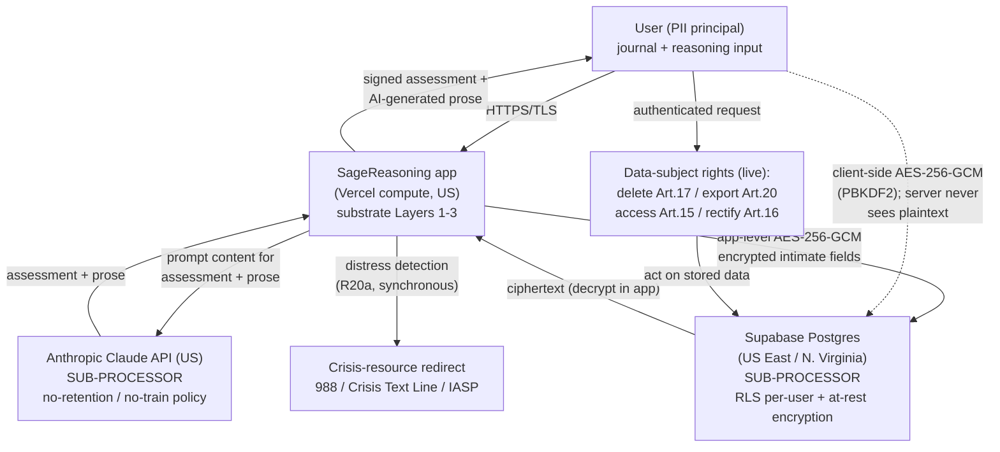

# Data Protection Impact Assessment — Intimate Data Processing (A16a)

**Status:** Draft — adopted as a founder-authored draft 2026-06-07 under `D-A16-A17-PRIVACY-REGULATORY-GOV-2026-06-07`. **Legal sign-off deferred** to the Stage-1-close lawyer engagement (see Lawyer Review Queue LRQ-1, LRQ-2, LRQ-5).
**Rules served:** R17 / R17a–R17i (intimate data protection + data-subject rights), R16 (data governance), R20a (vulnerable-user protection), R19 (honest positioning).
**Owner / controller:** founder (sole trader now; company-as-controller post-Pty Ltd incorporation, FPE-1).
**Frameworks:** GDPR Article 35 (DPIA); ISO/IEC 27701:2025 §6 (privacy risk / impact assessment); the SageReasoning ethical analysis (5 April 2026).

> **Why a DPIA.** The journal-interpretation pipeline, passion taxonomy, and mentor profile hold among the most intimate data a system could hold about a person. GDPR Art. 35 requires a DPIA for processing "likely to result in a high risk" — large-scale processing of special-category-adjacent psychological data qualifies. R17 already mandates protections beyond standard security; this DPIA documents the assessment behind them.

---

## 1. Description of the processing

**Purpose.** To provide Stoic philosophical companionship: to help a user examine their own judgments, track character development, and reason better. The intimate data exists to make the mentor relationship continuous and personalised.

**Nature.** A user submits journal entries and reasoning for assessment. The system extracts and stores derived "intimate" layers (passion map, trigger map, contradiction map, developmental timeline) plus a mentor profile and interaction history. Assessment and prose generation use the Anthropic Claude API. Authoritative assessments are cryptographically signed (Ed25519).

**Scope (today).** Founder is the sole live user; test logins exist. Designed to extend to a wider practitioner community. No EU users at present; no EU marketing at launch.

**Context.** Single-founder, pre-launch, R&D phase. The most sensitive extractions (trigger/contradiction maps) are the ones the ethical analysis flagged as enabling psychological manipulation if breached.

---

## 2. Data categories

| Category | Examples | Sensitivity |
|---|---|---|
| **Intimate / derived** | Passion map, trigger map, contradiction map, developmental timeline | **Highest** — psychological profile; breach enables manipulation |
| **Journal content** | Raw journal entries the user submits | **High** — encrypted client-side (server never sees plaintext where that path is used) |
| **Mentor profile + interaction history** | Profile fields, past reflections | **High** |
| **Account data** | Email, auth identifiers | Standard |
| **Assessment outputs** | Scores, reasoning, signed Layer 2 assessments | Moderate (derived; AI-generated) |

Passion-*profiling results* are private to the individual and their mentor relationship and are **never** exposed via any API (R17e). The 25-species passion *taxonomy* (the reference, not anyone's results) is available via API.

---

## 3. Data flow

User-supplied content is processed on Vercel (compute), reasoned over by the Anthropic Claude API, and stored in Supabase. **All three sub-processors operate in the United States.** See `/compliance/sub-processor-register.md` for the per-sub-processor detail.

---

## 4. Necessity & proportionality

- **Necessity.** The intimate layers are necessary for the core purpose (continuous, personalised practice). Without them there is no ongoing "practice", only one-off sessions (cf. R19e configuration honesty).
- **Proportionality.** Minimisation holds: profiling results stay private (R17e); bulk/third-party profiling is technically prevented (R17a); the most sensitive extractions are candidates for local-only storage (R17d, under consideration).
- **Lawful basis.** **Open legal question — deferred to lawyer (LRQ-1).** Candidates: consent, or legitimate interest (the EU Digital Omnibus may introduce a clearer legitimate-interest basis for AI). Not asserted here.

---

## 5. Risks to data subjects, and mitigations in place

| # | Risk | Likelihood (current scale) | Severity | Mitigations already in place |
|---|---|---|---|---|
| R1 | **Breach of intimate store enables psychological manipulation** | Low | **Severe** | App-level AES-256-GCM beyond DB-at-rest (R17b); RLS per-user; client-side encryption for journal data (server never sees plaintext); Supabase at-rest encryption |
| R2 | **Bulk / third-party profiling** (submitting others' content) | Low | High | R17a technical bulk-profiling prevention; only the subject (or authorised agent) can submit for assessment |
| R3 | **Profiling results leak via API** | Low | High | R17e: profiling results never exposed via any endpoint (taxonomy reference only) |
| R4 | **Sub-processor exposure** (Anthropic sees prompt content) | Medium | Moderate | Anthropic API no-retention / no-train policy; prompt content limited to what assessment needs; provenance signed |
| R5 | **Cross-border transfer** (EU subject → US hosting) | N/A today (no EU users) | High if EU users | No EU users / no EU marketing at launch; transfer mechanism (SCCs / DPF) is lawyer-queued before any EU launch |
| R6 | **Owner lock-out** (a protection that locks the data owner out) | Low | High | R17f: encryption/auth changes are Critical Change Protocol; rollback always founder-runnable |
| R7 | **Encryption-key loss or compromise** (single founder-held key) | Low–Medium | Severe | Founder-owned offline backup with monthly verification (ADR-A4 Option 4A); rotation-ready `version` field; KMS + per-user keys deferred-by-design to scale |
| R8 | **Harm to a user in acute distress** | Medium | Severe | R20a synchronous two-stage distress classifier on all 9 routes + crisis-resource redirect; mirror principle (R19d) discourages misuse |
| R9 | **Over-reliance / dependence** | Medium | Moderate | R20b independence coaching; success defined as needing the tool less over time |

---

## 6. Residual risk

After the mitigations above, the residual risks that **remain and are not closed by this draft** are:

1. **Lawful-basis uncertainty** (R4-adjacent) — until a lawyer confirms the basis, the processing rests on an unconfirmed footing. → **LRQ-1.**
2. **Erasure vs audit-retention tension** — genuine deletion (Art. 17) vs the need to retain some audit rows; the boundary needs legal confirmation. → **LRQ-2.**
3. **Cross-border transfer** — unmitigated *if* EU users are onboarded before a transfer mechanism is in place. Currently N/A. → sub-processor register + lawyer.
4. **Single-key custody** (R7) — operational, not legal; acceptable at single-founder scale per ADR-A4; revisit (KMS / per-user keys) at extension beyond founder.
5. **Residual-risk acceptance** — formal sign-off that the residual is acceptable is the controller's decision, and should be taken with legal input. → **LRQ-5.**

**No residual risk is declared "accepted" in this draft.** Acceptance is the founder's decision, to be taken after lawyer review (R19 — do not pre-empt the legal judgement).

---

## 7. Consultation & sign-off

- **Internal:** founder (controller) + AI-assisted drafting.
- **External (deferred):** lawyer engagement at Stage-1 close reviews lawful basis (LRQ-1), the erasure/retention tension (LRQ-2), and residual-risk acceptance (LRQ-5). Adversarial/external review of the broader safeguards is a separate, already-tracked item.
- **Review cadence:** this DPIA is revisited at each R14 quarterly review and whenever a change trigger fires (new data category, new sub-processor, EU-user onboarding, incorporation).

---

*End of DPIA draft. Structure complete on current understanding; the three legal determinations are queued, not assumed.*
