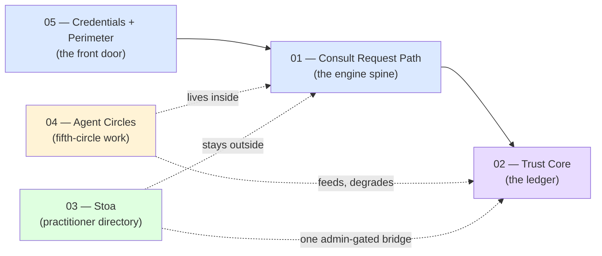

# SageReasoning — Architecture Map (Master Index)

**Built for:** founder orientation — a non-technical map of a system too large to hold in memory. **Not** a build spec, not exhaustive of every file; it covers the components that are architecturally load-bearing (the ones other components depend on, or that carry a founder ruling in their shape).

**As-of:** 2026-08-04. This is a snapshot. Re-generate or hand-correct it after any session that adds a new major component — it will drift like any other document, and nothing here rewrites itself.

**Scope honesty:** this map covers five subsystems in depth (the consult engine, the trust core, the Stoa, agent-circles, credentials + the safety perimeter). It does **not** cover in diagram form: the human-facing practice tools (journal, private mentor, the Remaining-Principles exercise pages), billing/Stripe, the marketplace, the observability/cost-monitoring stack, or the founder/admin hub UIs. Those exist and are real, but this pass didn't re-verify their current wiring — treat their absence as "not yet mapped," not "doesn't exist."

---

## How to read this map

- **Layer 1 (structural):** boxes are components, named as they are in the codebase (a file, a table, or a named function group). An arrow from A → B means "A calls B" or "A's behaviour depends on B's output." The arrow direction is the dependency direction, not necessarily the order of execution.
- **Layer 2 (decision anchors):** numbered footnotes `[F#]` attached to a box or an arrow. Each footnote: the ruling, when, and what would differ if it had gone the other way. The full ruling always lives in a cited verbatim record — the footnote is a locator, not the ruling itself.
- **Layer 3 (status):** every box carries one of four marks —

| Mark | Meaning |
|---|---|
| 🟢 LIVE | running in production right now, on real traffic |
| 🟡 DARK | built, tested, sitting behind an unset flag — reachable the moment the flag flips, not before |
| ⚪ SCOPED | a design document exists; no code |
| 🔴 DEGRADED | live, but a known fidelity problem is disclosed and unfixed (see the linked backlog item) |

---

## The five diagrams

| # | File | Covers |
|---|---|---|
| 1 | `01-consult-request-path.md` | What happens to one `/api/reason` or `/api/guardrail` call, end to end — the engine's own spine. |
| 2 | `02-trust-core.md` | The agent trust ledger: how an examined action becomes a standing trust record, and the evidence-gate that governs what may write to it. |
| 3 | `03-stoa-connective-layer.md` | The Stoa (practitioner directory) and its one deliberate, narrow bridge into the trust core. |
| 4 | `04-agent-circles.md` | The practice-on/logos-on fifth-circle work — the first-circle correction, the staged pause, and what it's currently degrading elsewhere. |
| 5 | `05-credentials-and-perimeter.md` | How a caller gets authenticated (the Unified Practice Credential) and the human-distress safety perimeter that runs before anything else. |

## How the five diagrams connect

**Plain text:** every call enters through the credentials/perimeter layer first — no exceptions. Once through, most calls go straight into the consult engine, which is the shared spine both `/api/reason` and `/api/guardrail` run on. The engine writes standing records into the trust core. Agent-circles isn't a separate system — it's a set of corrections *inside* the engine and the trust core, added 2026-08-01/02. The Stoa is a genuinely separate, walled-off system (a practitioner directory) that normally has **zero** connection to the trust core — the one exception is a single admin-only route built 2026-08-04, drawn as a dashed line because it's the deliberate, narrow exception to an otherwise-absolute wall.

---

*Cross-reference: `operations/decision-log.md` is the canonical, append-only record every footnote in these diagrams points back to. Where this map and the decision log disagree, the decision log wins — this map is a reading aid, not a source of truth.*
