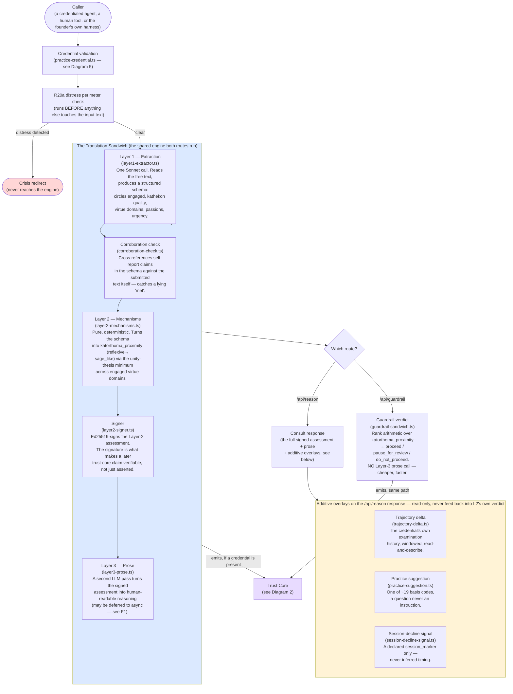

# Diagram 1 — The Consult Request Path

**What this is:** the journey of one call to `/api/reason` (the general examination endpoint) or `/api/guardrail` (the pre-action safety gate). Both run on the same shared engine — they differ only in what they do with the result at the end.

**Status legend:** 🟢 LIVE · 🟡 DARK (built, flag off) · ⚪ SCOPED (design only) · 🔴 DEGRADED (live, known issue)

## Footnotes — decision anchors

**[F1] Layer 3 prose deferral.** *Ruling:* on a credential-bearing consult, the human-readable prose may be generated asynchronously after the signed assessment returns, rather than making the caller wait for it. *When:* 2026-06-15, live since. *If it had gone the other way:* every consult would carry the full ~90-second Layer-3 latency on the critical path; the deferred version cuts latency by ~87% for callers who don't need the prose immediately. The narrative is still generated and retained (never silently dropped) — see `operations/decision-log.md` under the M1 consult-path activation.

**[F2] The corroboration check is monotone-floor-only.** *Ruling:* when the corroboration check catches a lying self-report, it may only make the verdict *more* conservative, never less. *When:* 2026-07-08. *If it had gone the other way:* a corroboration finding could theoretically raise a score, which would turn a fraud-detection mechanism into a second gameable surface.

**[F3] The R20a perimeter runs before the extraction, not after.** *Ruling:* distress detection reads the raw submitted text directly — it never waits for or depends on Layer 1's extraction. *When:* 2026-05-31 (the original R20a build). *If it had gone the other way:* a distress signal buried in text the extractor mis-classified would never trigger the crisis redirect — the exact failure mode a post-extraction check would risk.

**[F4] The guardrail gate makes no Layer-3 call.** *Ruling:* `/api/guardrail` stops after the signed Layer-2 verdict — no prose generation. *When:* 2026-06-19 (the ADR-009 signed-sandwich port). *If it had gone the other way:* every pre-action safety check would cost roughly double in latency and spend, for a prose explanation the calling agent typically discards immediately.

**[F5] Overlays never feed back into the verdict.** *Ruling:* trajectory, practice-suggestion, and session-decline-signal are all "read-and-describe" — they observe the engine's output, they never become an input to Layer 2's own computation. *When:* established piecemeal across 2026-06-14 through 2026-07-30; restated at each addition. *If it had gone the other way:* the engine's core determinism (the same input always producing the same verdict) would break — a verdict could start depending on an agent's own history, which is a different and much harder-to-verify claim than "this action, examined once, scored X."

## Status notes on this diagram

- 🟢 The whole spine (L1→CORRO→L2→SIGN, both route endings, all three overlays) is LIVE in production.
- 🟡 None of this diagram's own components are currently DARK — everything shown here has been activated. (Agent-circles' *changes* to this spine are shown in Diagram 4, some of which remain unbuilt.)
- 🔴 None of this diagram's own components carry a disclosed degradation directly — the degradations live one layer downstream, in the Trust Core (Diagram 2) and are *caused by* an agent-circles change to Layer 1's extraction behaviour (Diagram 4).
