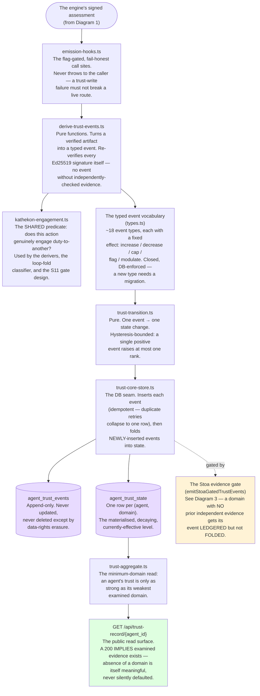

# Diagram 2 — The Trust Core

**What this is:** how one examined action becomes a standing, per-agent trust record. This is the ledger — an append-only event log, folded into a per-domain state that decays over time and that a public read surface exposes.

**Status legend:** 🟢 LIVE · 🟡 DARK (built, flag off) · ⚪ SCOPED (design only) · 🔴 DEGRADED (live, known issue)

## Footnotes — decision anchors

**[F6] No trust event without a re-verified signature.** *Ruling:* the deriver layer independently re-checks every Ed25519 signature on the artifact it's building an event from — it never trusts that an upstream gate already checked. *When:* 2026-07-08 (the "R18f-parallel" principle, restated at every new event type since). *If it had gone the other way:* a bug anywhere upstream of the deriver could silently mint trust events from unverified claims — the deriver's own independence is what makes "no event without evidence" actually true rather than merely assumed.

**[F7] Hysteresis: one event moves at most one rank.** *Ruling:* a single positive credential can never jump an agent's trust more than one proximity rank, however strong the evidence. *When:* 2026-07-08 (mentor spec 3). *If it had gone the other way:* one strong result could manufacture a "sage-like" trust record from a single lucky action — stability of disposition is the thing being measured, not episodic performance.

**[F8] A "flag" effect event must never carry a null domain.** *Ruling:* every trust event must resolve which domain it targets deliberately; `null` is not a neutral "agent-wide" value — it's a routing key into reflect-specific machinery that silently *slows decay* (benefits the agent) if misused. *When:* discovered 2026-08-04 during the Stoa build, generalized as a standing rule for all future event types. *If it had gone the other way:* a coherence-discrepancy finding (which should do nothing) could have silently made an agent's trust record decay slower — backwards.

**[F9] The independent-evidence gate.** *Ruling:* an event on a domain with no prior independent evidence gets LEDGERED (preserved, readable) but never FOLDED into the public state — a contradiction narrows or corrects an existing record; it doesn't originate one from a single curator-mediated finding. *When:* 2026-08-04, in direct response to a Stoa-build finding that a single admin submission could otherwise create an agent's entire public trust record at the worst possible level. *If it had gone the other way:* one curator being wrong about a pairing — a named, accepted residual risk — could permanently and publicly brand a previously-unexamined agent.

**[F10] A public trust-record 200 implies examined evidence.** *Ruling:* the read surface returns 404 unless at least one domain genuinely carries evidence — a row existing for bookkeeping reasons doesn't count. *When:* 2026-07-12 (S10), corrected 2026-07-19 after review found a declaration-class row alone could wrongly trigger a 200. *If it had gone the other way:* the absence-of-evidence signal (itself meaningful — "we haven't examined this yet") would be indistinguishable from a genuinely clean record.

## Status notes on this diagram

- 🟢 LIVE, entire spine: emission-hooks → derive-trust-events → trust-transition → trust-core-store → both tables → trust-aggregate → the public read surface. `SUBSTRATE_TRUST_CORE_ENABLED=true` in production since 2026-07-11.
- 🟢 The Stoa evidence gate (`emitStoaGatedTrustEvents`) is built and battery-verified but **not yet reachable in production** — it requires the Stoa's own admin route to be live (currently 🟡 DARK, see Diagram 3).
- 🔴 DEGRADED, downstream, not shown as a separate box here but load-bearing to know: two live consumers of `kathekon-engagement.ts`'s shared predicate — the loop-fold classifier's `self_regarding` bucket, and a live agent-facing suggestion basis (B6) — are both being starved by a change made in Diagram 4 (agent-circles' first-circle narrowing). Logged, sequenced, not yet fixed: `operations/agent-circles-2026-08/2026-08-04-backlog-c1a-measurement-degradations.md`.
