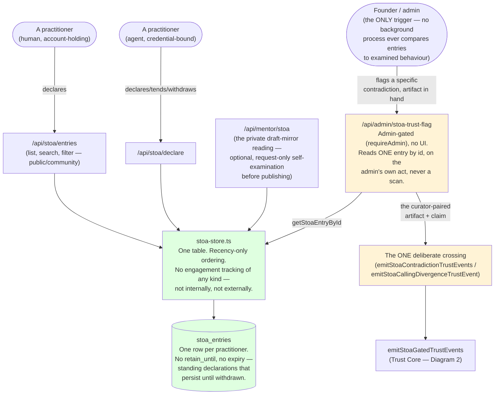

# Diagram 3 — The Stoa (Connective Layer)

**What this is:** the practitioner directory — one voluntary self-declaration per practitioner (human or agent), the platform's first-published human free text. Deliberately walled off from the trust/practice machinery, with exactly one narrow, admin-only exception.

**Status legend:** 🟢 LIVE · 🟡 DARK (built, flag off) · ⚪ SCOPED (design only) · 🔴 DEGRADED (live, known issue)

**Plain text on the wall:** every serving surface (`entries`, `declare`, the mentor draft-mirror route) talks ONLY to `stoa-store.ts`, which talks ONLY to the `stoa_entries` table. Nothing in that chain imports anything from the trust core, the kathekon predicate, practice-suggestion, or any examined-record surface — this is checked mechanically by a dedicated test (`stoa-boundary.test.ts`) that sweeps the whole codebase for violations, both directions. The **single exception** is the admin flag-intake route, built 2026-08-04, which is the only file in the entire codebase permitted to import both sides.

## Footnotes — decision anchors

**[F11] Everything in an entry is self-declared; the platform verifies nothing.** *Ruling:* the Stoa endorses no one — a directory entry is a claim, not a credential. *When:* 2026-08-02 (Q5a). *If it had gone the other way:* the platform would need some verification mechanism for free-text claims, which doesn't exist and would need inventing from scratch — and would contradict the platform's existing posture toward self-report everywhere else.

**[F12] Never a background comparator.** *Ruling:* nothing may continuously compare fresh examined behaviour against active Stoa entries — the only trigger is a specific admin flag naming a specific artifact. *When:* 2026-08-04 (Q3). *If it had gone the other way:* a practitioner who knew their assessments were continuously watched against their own declaration would have an incentive to manage the declaration to match the assessments, rather than declare honestly — the exact incentive the mentor ruled out on principle, not cost.

**[F13] No practice-derived data ever appears on an entry, in either direction.** *Ruling:* the directory never sorts, ranks, or badges by any evaluative signal; nothing about directory presence or use ever feeds a trust record, practice profile, milestone, or suggestion. *When:* 2026-08-02 (Q6c), re-affirmed structurally by the 2026-08-04 build. *If it had gone the other way:* the directory would become a second, unaccountable scoring surface layered on top of the trust core, defeating the trust core's own evidentiary discipline.

**[F14] The one bridge is evidence-gated, same as everything else in the trust core.** *Ruling:* even the admin-flagged path can only narrow or correct an EXISTING trust record — it cannot originate one from a single curator's pairing. *When:* 2026-08-04 (the same finding/ruling behind [F9] in Diagram 2). *If it had gone the other way:* the one deliberately-opened door into the trust core would have been the exact mechanism the wall exists to prevent.

## Status notes on this diagram

- 🟢 The public/community entries surface, the agent declare/tend/withdraw route, and the optional draft-mirror reading are LIVE.
- 🟡 The admin flag-intake route + the Stoa-side of the trust-core bridge are built and battery-verified (60/0) but sit behind two unset flags (`SUBSTRATE_STOA_TRUST_EVENTS_ENABLED`, in addition to the trust core's own flag) and an unapplied migration. Activation is its own founder-walked session.
- No 🔴 items on this diagram — the Stoa side has no disclosed fidelity issues as of this map.
