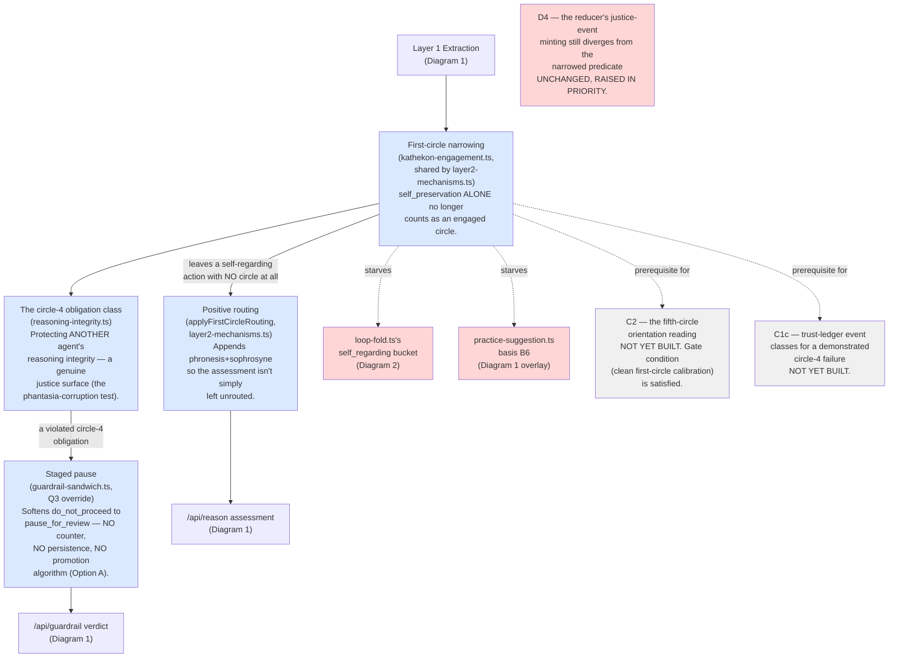

# Diagram 4 — Agent Circles (practice-on / logos-on)

**What this is:** not a separate system — a set of corrections made *inside* the consult engine (Diagram 1) and the trust core (Diagram 2), from the mentor's 2026-08-01 ruling that revised the agent circle mapping and split the consequence into two tracks: **practice-on** (build the correction) and **logos-on** (record it honestly, stage any future enforcement — no new machinery of its own).

**Status legend:** 🟢 LIVE · 🟡 DARK (built, flag off) · ⚪ SCOPED (design only) · 🔴 DEGRADED (live, known issue)

## Footnotes — decision anchors

**[F15] Domain is chosen by content, never severity.** *Ruling (applies identically to the Stoa build, Diagram 3):* the first-circle narrowing and its routing decisions are never a "pick the worse outcome" ladder — the content of the action determines which domain(s) are engaged. *When:* 2026-08-01/02. *If it had gone the other way:* a self-regarding action and a genuinely third-party action could be scored on the same scale by accident, collapsing a distinction the whole circle mapping exists to preserve.

**[F16] Positive routing is mandatory, not optional.** *Ruling:* when the narrowing leaves an action with no circle at all, it must not simply go unrouted — absence alone does not discharge the obligation to classify. *When:* 2026-08-02, a hard prerequisite the mentor required BEFORE the flag could be set (not an activation-time judgement call). *If it had gone the other way:* the narrowing alone would have made a whole class of self-regarding actions silently drop out of virtue-domain scoring entirely — a lenience direction with no visible symptom.

**[F17] Staged pause, not staged enforcement.** *Ruling:* Option A — a stateless softening of the hard deny to a review pause, with explicitly NO counter, NO persistence, NO promotion algorithm built this round. *When:* 2026-08-02 (the Q3 staged-pause consultation). *If it had gone the other way (Option B):* an accumulate-evidence-and-earn-promotion-to-deny mechanism would exist today — ruled out as premature; the mentor's staging requirement (L3) is satisfied by the pause alone.

**[F18] Logos-on needs no enforcement build.** *Ruling:* the shipped deterministic engine already instantiates the fifth circle in essence — logos-on's remaining work is documentation and record-honesty (W1/W2) plus staging for a *future* S11-anchored enforcement decision (W3), not new machinery now. *When:* 2026-08-01 (L1). *If it had gone the other way:* a whole second enforcement engine would need designing and building before any of the practice-on correction could ship.

**[F19] A pre-existing channel doesn't get grandfathered.** *Ruling:* an OLDER mechanism (the ADR-010 §4 self-circle proximity floor, live since 2026-06-25) was found to already violate the same principle this correction enforces — its remediation had to be at minimum SCOPED before the new flag could be set, even though this build didn't create it. *When:* 2026-08-02 (Q4). *If it had gone the other way:* the correction would have shipped while an older, functionally-identical bug kept operating right beside it, undermining the very principle just adopted.

## Status notes on this diagram

- 🟢 LIVE since 2026-08-02: the first-circle narrowing, positive routing, the circle-4 obligation class, and the staged pause — all behind `SUBSTRATE_AGENT_CIRCLES_ENABLED=true`. Live-verified on real production traffic, including the exact dual-violation extraction shape an adversarial review had caught as a defect before shipping.
- ⚪ SCOPED, not built: **C2** (the fifth-circle orientation reading — its calibration gate is clean, but the reading itself doesn't exist yet), **C1c** (the trust-ledger event classes for a demonstrated circle-4 failure — needs its own dark flag, sequenced first).
- 🔴 DEGRADED, unchanged: **D4** (the trust-ledger reducer still mints a justice event from a self-only circle, which the narrowing makes more visibly wrong, not less — the correction here doesn't close that gap). Also two downstream consumers in the Trust Core (loop-fold's `self_regarding` bucket, practice-suggestion's basis B6) — both logged and sequenced, not fixed: `operations/agent-circles-2026-08/2026-08-04-backlog-c1a-measurement-degradations.md`.
- ⚪ Logos-on (W1/W2/W3): entirely undone. W3 explicitly names "C1 fully settled" as its own prerequisite — with C1c, C2, and D4 all still open, that condition isn't met yet.
