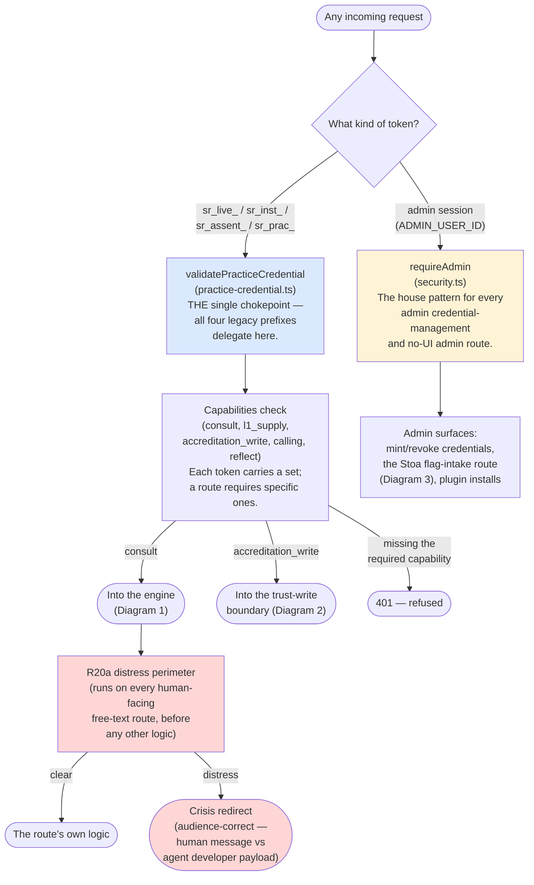

# Diagram 5 — Credentials & the Safety Perimeter

**What this is:** the front door. Every request into the system passes through authentication first, and every human-facing route that accepts free text passes through the distress perimeter before its own logic runs.

**Status legend:** 🟢 LIVE · 🟡 DARK (built, flag off) · ⚪ SCOPED (design only) · 🔴 DEGRADED (live, known issue)

**Plain text on the perimeter box's colour:** it's marked the same visual weight as a "degraded" item deliberately — not because it's broken, but because it is the single most consequence-bearing piece of this whole system. It runs first, on every route in its registry, with no exceptions, and its correctness is checked by a dedicated mechanical guard (`r20a-invocation-guard.test.ts`) that fails the build if a new distress-touching route is added without wiring it in.

## Footnotes — decision anchors

**[F20] One credential, one chokepoint.** *Ruling:* the three separate legacy credential classes (`sr_live_` for consult, `sr_inst_` for install, `sr_assent_` for write) were consolidated into one Unified Practice Credential with a capability set, validated through a single function every legacy validator now delegates to. *When:* 2026-06-15 (CI-14). *If it had gone the other way:* three separate validators would keep drifting independently — the exact failure class (a write-class capability check silently missing on one of three paths) that motivated the consolidation in the first place.

**[F21] Write-class capabilities require the Bearer header, never an API key alone.** *Ruling:* `accreditation_write`, `calling`, and `reflect` may only be presented via `Authorization: Bearer`, never the looser `X-Api-Key` header consult accepts. *When:* 2026-06-15, alongside [F20]. *If it had gone the other way:* a write-capable credential would be exposed to the same looser transport surface as a read-only one, widening the blast radius of a leaked key.

**[F22] The distress perimeter runs before extraction, not inside it.** *Ruling:* see [F3] in Diagram 1 — restated here because it's the perimeter's own defining property, not a detail of the engine it happens to sit in front of. *When:* 2026-05-31. *If it had gone the other way:* a distress signal would depend on an LLM extraction correctly noticing it first — an extra, unnecessary point of failure between a person in crisis and the redirect that's supposed to reach them.

**[F23] Admin routes reuse one house gate, never invent a new one per route.** *Ruling:* every admin credential-management or no-UI admin route (mint, revoke, the Stoa flag-intake) uses the same `requireAdmin`/`ADMIN_USER_ID` pattern — distinct from the separate `ADMIN_EMAILS` allowlist (used for one billing surface) and `FOUNDER_USER_ID` (used for the founder's private surfaces). *When:* established 2026-05-21, confirmed as the correct choice for new admin routes as recently as 2026-08-04. *If it had gone the other way:* three non-interchangeable admin gates in active use, with no rule for which new route should use which, would make it easy to wire a new admin surface to the wrong one by accident.

## Status notes on this diagram

- 🟢 The entire credential/capability chokepoint and the R20a perimeter are LIVE, and have been for the longest of any subsystem in this map (the perimeter since 2026-05-31, the UPC since 2026-06-15).
- No 🟡 or ⚪ items on this diagram as of this map — the front door itself has no outstanding build work; what's outstanding elsewhere (Diagrams 3 and 4) is downstream of it.
- No 🔴 items — no disclosed fidelity issue currently lives at the auth/perimeter layer itself.
